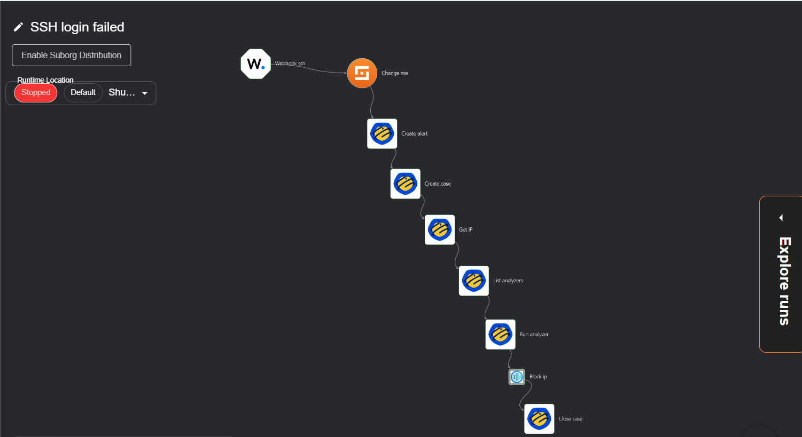
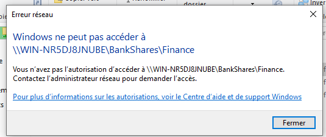
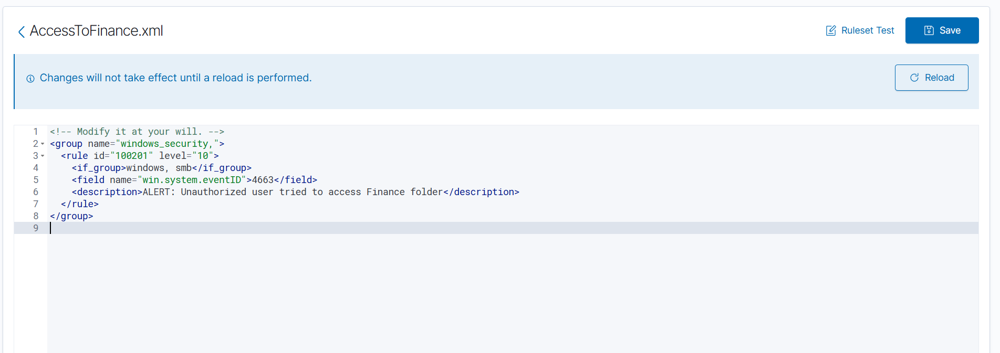
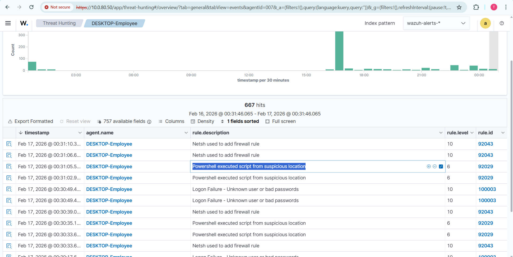
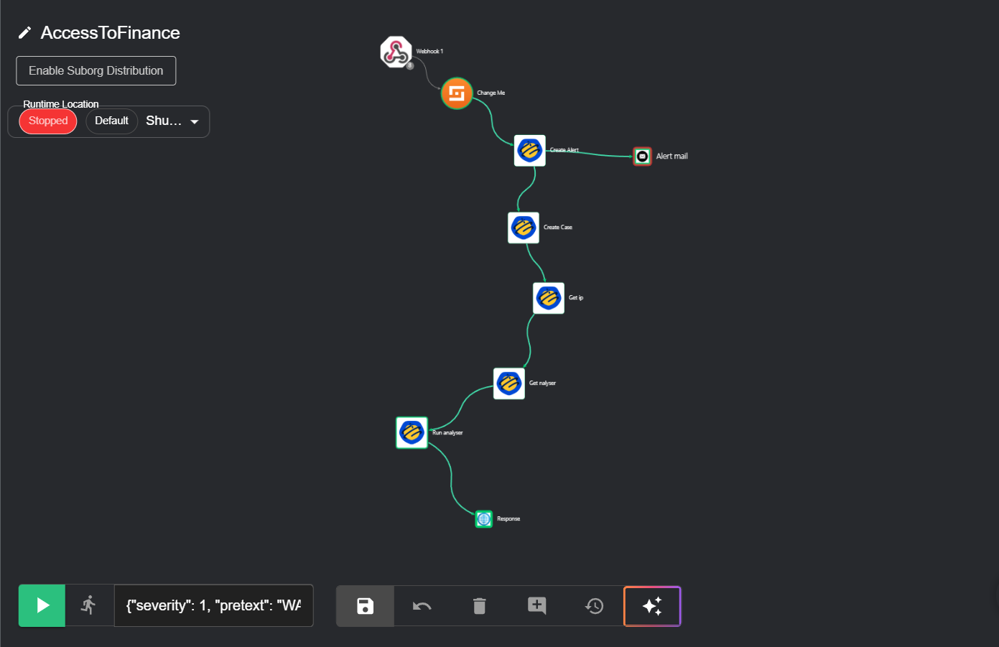
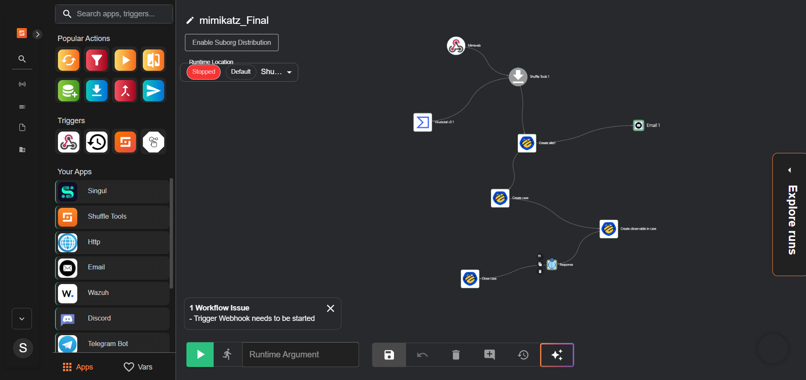
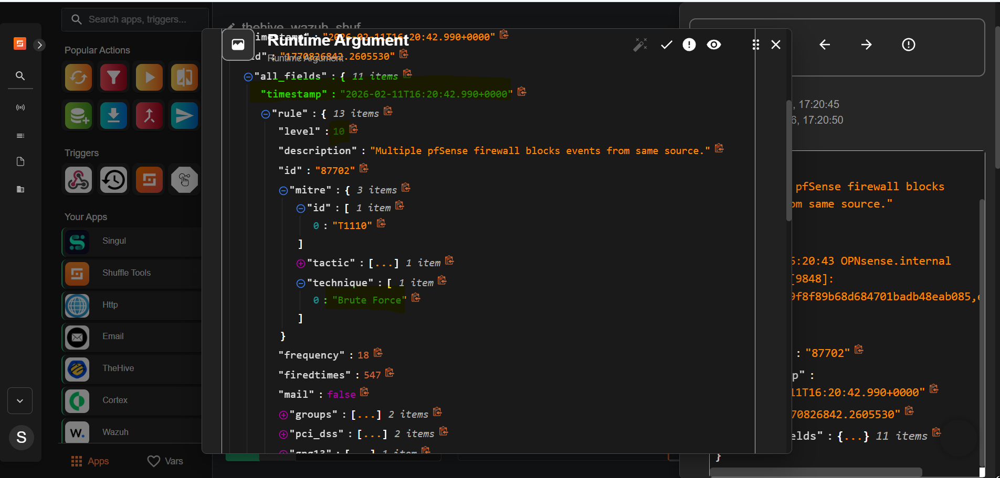

# Attack Scenarios & Detection Results

Each scenario below documents what was reproduced in the lab, what Wazuh/Shuffle/TheHive actually captured, and what the evidence does — and does not — prove. This distinction matters: a successful API call or workflow execution confirms that step succeeded, not that the full incident lifecycle (detection → containment → resolution) was completed.

## SSH Brute-Force Scenario

**MITRE ATT&CK:** T1110 (Brute Force), T1078 (Valid Accounts)

Reproduction steps: multiple failed SSH login attempts followed by a successful authentication.

The workflow is triggered by a Wazuh webhook and chains through alert enrichment, TheHive case creation, and (where configured) a containment step. The workflow structure is confirmed; a full timing measurement (detection-to-containment) was not captured.

**Note:** The linked TheHive case for this scenario references Windows Event ID 4625 (a Windows logon failure), while the workflow itself is named for SSH. Detection should be treated per-source (SSH for Linux hosts, Windows Authentication for AD/domain hosts) — a single workflow name should not be assumed to cover both.

## Finance Share Access Scenario

Scenario: an unauthorized attempt to access a restricted file share (`BankShares\Finance`).

The access denial confirms that Windows file permissions blocked the attempt. This is a result of existing NTFS permissions — it does not, by itself, demonstrate that the SOAR pipeline dynamically triggered the block.

A custom Wazuh rule detects Event ID 4663 (object access attempt) on the Finance share and assigns it severity level 10.

**What remains to validate:** linking a specific access attempt to the triggering account, the Windows event, the Wazuh rule, and the resulting TheHive case in a single traceable chain — and confirming that a legitimate, authorized user retains access (to rule out a false-positive lockout).

## Mimikatz Detection Scenario

A defensive detection exercise — this project does not reproduce credential-extraction techniques, only the detection and alerting path.

The workflow chains Wazuh alert ingestion, TheHive case creation, and an email notification step. Email notifications were confirmed as received (SOC alert channel) — this is separate from and does not validate the MidPoint Joiner welcome-email pipeline, which uses a different configuration and remains unresolved (see [`LIMITATIONS.md`](./LIMITATIONS.md)).

## Network / Firewall Correlation Scenario

A correlated alert (severity level 10) was generated for multiple firewall block events from a single source, tagged with a brute-force technique reference. This confirms that a network event reached the orchestrator with a MITRE tag attached — it does not confirm that a DDoS attack was identified via a trained detection model, or that automated containment executed. The classification (brute-force vs. volumetric attack) should be re-evaluated against raw logs, request volume, and network context before being reported as a confirmed DDoS detection.

## Phishing Detection Scenario

**MITRE ATT&CK:** T1566 (Phishing)

A machine learning text-classification model analyzes incoming emails to detect phishing attempts. Flagged emails are labeled and quarantined in Gmail rather than left in the inbox.

The system assigned an 80% phishing confidence score, identified the suspicious link, and explained the flagging reason (urgency + unverified link). The email was moved out of the inbox and tagged for review rather than auto-deleted, allowing a user to restore it if misclassified.

Three labels structure the pipeline: `PHISHING_SCANNED` (processed), `PHISHING_ANALYZED` (classification complete), and `PHISHING_QUARANTINE` (flagged and isolated).

**What this demonstrates:** the classification model correctly flagged a simulated phishing email, extracted and scored the embedded link, and applied a quarantine label — on this one test case.

**What remains to validate:**
- Classification accuracy across a labeled dataset (precision/recall), rather than a single test case
- False positive rate — legitimate emails incorrectly quarantined
- Behavior on borderline or evasive phishing attempts (e.g. lookalike domains, no obvious keywords)
- Whether end users are separately notified, or only see the effect via the quarantine label

## Compliance & MITRE ATT&CK References

Standards references (ISO/IEC 27001, PCI DSS, SWIFT CSP) and MITRE ATT&CK technique tags shown in TheHive case descriptions reflect the lab's rule configuration. These are configured associations, not the result of an independent compliance audit — see [`Compliance.md`](./Compliance.md) for the full discussion.
